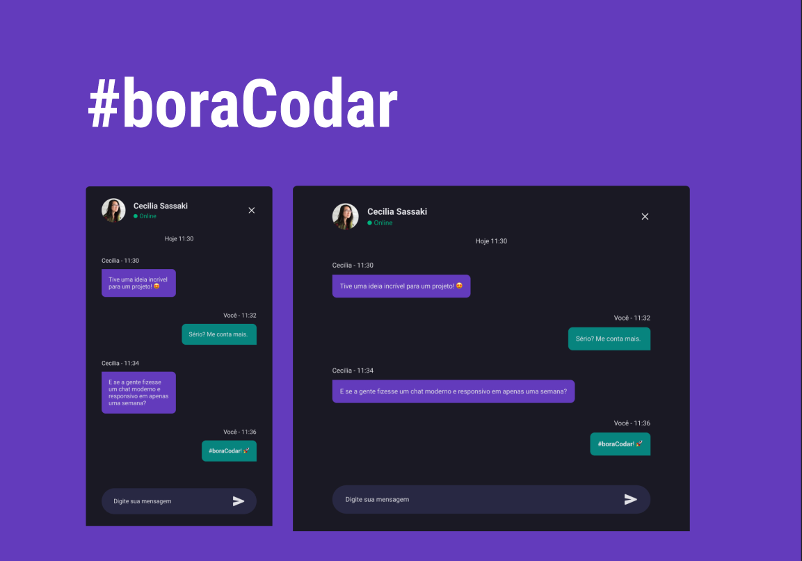

<h1 align="center">Chat</h1>

Projetando um chat no desafio <strong>#boracodar</strong> 🚀

    <a href="#-tecnologias">Tecnologias</a>&nbsp;&nbsp;&nbsp;|&nbsp;&nbsp;&nbsp;
    <a href="#-projeto">Projeto</a>&nbsp;&nbsp;&nbsp;|&nbsp;&nbsp;&nbsp;
    <a href="#-layout">Layout</a>&nbsp;&nbsp;&nbsp;|&nbsp;&nbsp;&nbsp;
    <a href="#memo-licença">Licença</a>&nbsp;&nbsp;&nbsp;|&nbsp;&nbsp;&nbsp;
    <a href="#">Contato</a>

 

    

  

## 🚀 Tecnologias

Esse projeto foi desenvolvido com as seguintes tecnologias:

- HTML e CSS
- JavaScript
- Git e Github
- Figma

## 💻 Projeto

Projeto de um chat interativo, propostos pela RocketSeat no desafio #boraCodar 🚀. Você pode acessar o projeto online [CLICANDO AQUI](https://thiagonevesalmeida.github.io/chat/).

## 🔖 Layout

Pode vizualizar o layout do projeto através [DESSE LINK](https://www.figma.com/community/file/1200070743637495660). É necessário ter conta no [Figma](https://figma.com) para acessá-lo.

## 📝 Licença

Esse projeto está sob a licença MIT.

## 📨 Contato

thiagonevesdealmeida@gmail.com

[linkedin.com/in/thiagonevesdealmeida](https://www.linkedin.com/in/thiagonevesdealmeida/)
